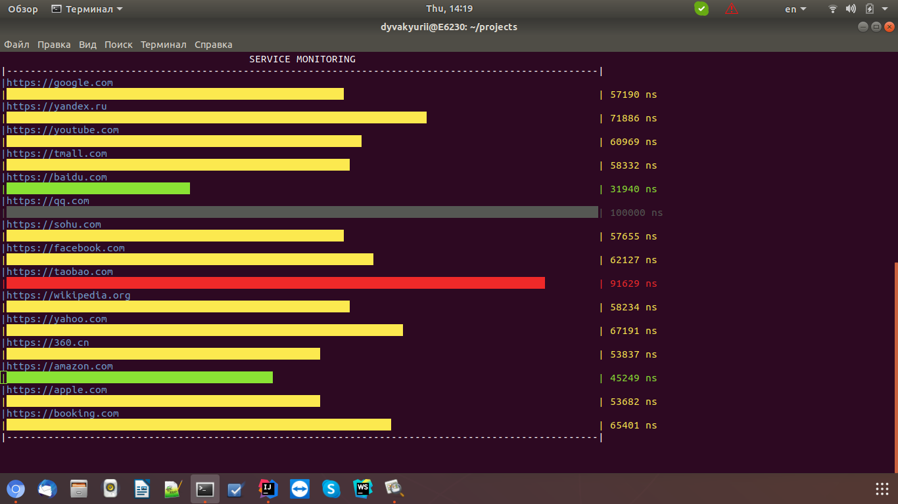

## Description 

I needed special tool for service monitoring strictly from linux terminal
Did not find any appropriate tool, and developed by myself
Look at picture


## Type of change:  
Developed new application for service monitoring  

## Details
Used Python without any additional libs
for performing use command
```
python3 service-monitoring.py [urls]
```  
## How Has This Been Tested?  
Used command
```
python3 service-monitoring.py https://google.com https://yandex.ru https://youtube.com https://tmall.com https://baidu.com https://qq.com https://sohu.com https://facebook.com https://taobao.com https://wikipedia.org https://yahoo.com https://360.cn https://amazon.com https://apple.com https://github.com https://booking.com
```
list of the services for testing

###### USA  
- [x] https://google.com
- [x] https://youtube.com
- [x] https://facebook.com
- [x] https://wikipedia.org 
- [x] https://yahoo.com 
- [x] https://amazon.com 
- [x] https://apple.com

###### China  
- [x] https://tmall.com
- [x] https://baidu.com 
- [x] https://qq.com 
- [x] https://sohu.com 
- [x] https://taobao.com 
- [x] https://360.cn  

###### Netherlands  
- [x] https://booking.com  

###### Russia  
- [x] https://yandex.ru
